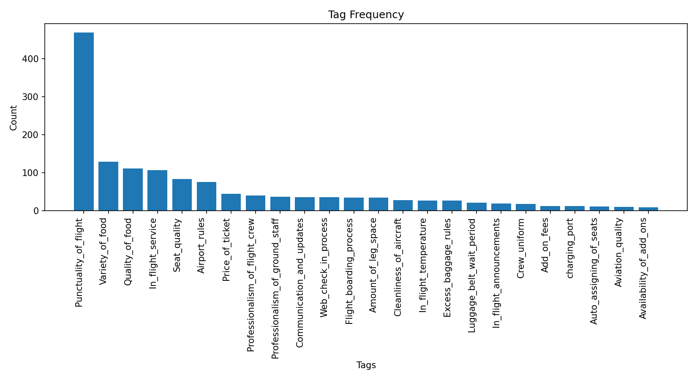
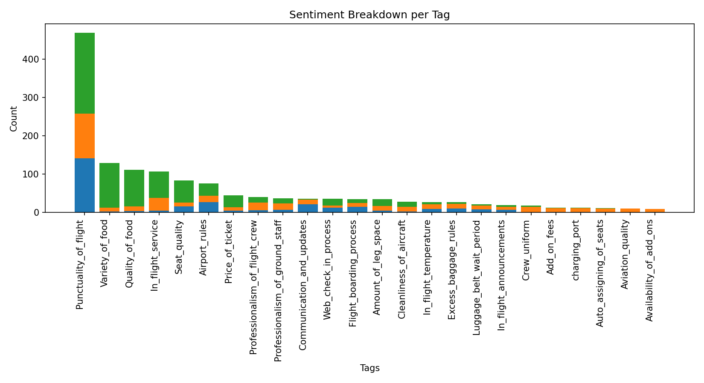

The primary objective was to design, develop, and implement a Python-based solution to automate the sentiment analysis of customer feedback. Key goals included:

To preprocess and clean large volumes of unstructured text data from customer surveys.

To apply NLP techniques to identify and categorize customer feedback into predefined service buckets (e.g., aviation quality, seat quality, punctuality).

To perform sentiment analysis on the categorized feedback to classify it as positive, negative, or neutral.

To visualize the analyzed data to provide clear, actionable insights for the Customer Experience team

project 1 : TOP 20 words mentioned in the feedback repeatatively
Files : Project > Top words analysis
Achivements : Automated the customer feedback analysis process, Listing Top 20 frequently mentioned words which will eventually point to the domains of the company which are being mentioned with the sentiment scores for each word in what way the word is mentioned positive neutral or negative thus saving significant man-hours and eliminating the subjectivity of manual review for the Customer Experience team.

Results:

  <kbd>
    
  </kbd>
   

Project 2 : Adanced Bucketing of feedbacks to each domains
Files : Project Advanced Lite & Pro 
        The lite version is fast by using just rule based tagging where as Pro takes time and analysis is done using Zero shot Fallback
Achivements : Similarly an advanced version of this project provided clear, quantitative insights into customer pain points by categorizing sentiment across various service areas like punctuality, quality, mannerism etc.

Results:

  <kbd>
    
  </kbd>
   
   

  <kbd>
    
  </kbd>
   

